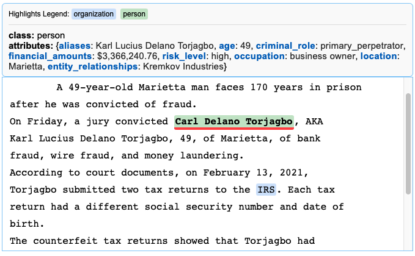
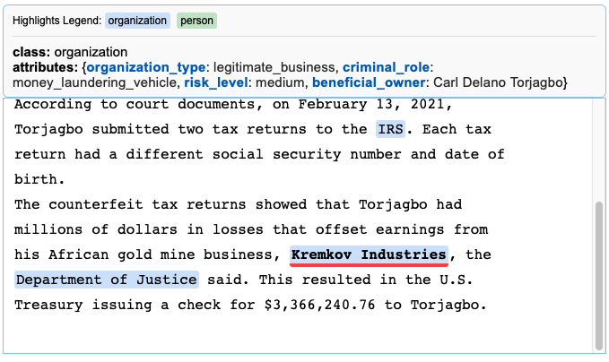

# Adverse media screening for millions of banking clients 

Large financial institutions need to understand the nature of their clients, they need to know their customer. 

An initial screening takes place when a prospective customer signs up for a bank, questionnaires are filled out, interviews conducted and the result is a set of entries into the customer database, containing perhaps the origin of funds, the nature of the business, biographical information etc. It is of course possible to lie or withhold certain truths during this initial screening, and things can also materially change after the customer has been officially registered. 

How can a financial information continuously monitor their clients? One source of such information is global news. With customers from hundreds of nations all over the world, a large multinational bank is faced with hundreds of thousands of potentially relevant news articles and alerts every day. Flagging such pieces of information for relevance and reviewing them is a requirement, a necessary cost for retaining reputation and licenses. It can also be very expensive, with lots of false positives that need manual review and deflagging (of course in some less direct way a failure to flag a true positive is potentially a lot more expensive). The 2025 RiskON featured exactly this kind of adverse media screening as a challenge. 

## Data 

The data provided was a list of aboout 2 million customer entries

```json 
{
   "customer_id":31,
   "first_name":"Adam",
   "last_name":"Ching",
   "date_of_birth":"1977-01-05",
   "city":"Rohrdorf",
   "country_of_residence":"DE",
   "nationality_1":"ES",
   "nationality_2":"",
   "customer_since":"2011-08-22T00:12:35.265",
   "bio_text":"Adam Chink, born in 1977, is a Spanish national who supports himself by working as a Systems Administrator, ensuring the smooth operation of the digital infrastructure."
  }
```

and 80k news articles similar to this one below, where I have shortened the `article_text` field to avoid clutter. 

```json
{
  "customer_id": "1462162",
  "article_title": "CATHYE GUENTER: SWISS ITALIAN FRAUDSTER OR INNOCENT VICTIM",
  "article_text": "By **Jane Doe**, Investigative Journalist\n\nAnacapri, Italy \u2014 The small island town of Anacapri, known for its scenic beauty and tranquility, has been rocked by a scandal involving one of its own, Cathye Guenter. The 34-year-old woman, born and raised in the picturesque town, has been accused of a series of credit card fraud schemes that have left authorities baffled and victims outraged.....",
  "article_date": "2025-03-30",
  "article_id": 1
 }
```

Some of these news articles have a nonempty `customer_id`, meaning that in the training data set, these were identified as both being adverse media and matching a customer of the bank. This was the case for roughly a third of the articles, which is probably substantially more than what one would encounter in the wild.

The test data set contained 50k articles without a customer label and the idea was to give such a label, possibly an empty string, meaning no match, to each news article. Based on API keys made available to us, the implicit recommendation was to use large language models. On the final day of the challenge, the test set was reduced from 50k to 300 articles, significantly altering the constraints of the task. 

## Proposed design 

### Article filtering 

Not all news articles are relevant: A successful opening to this year's farmer's market on the English countryside is a lot less likely to contain major financial crimes news than an article with a title like the example one above. 

From this we realize the need to do some kind of article filtering. The approach we took is based on embedding the titles of the news articles. The reasoning behind this is that titles contain a lot of signal, and should ideally summarize what the article is about. We also considered a keywords based approach (applied on the full article text), but determined that embeddings and a filtering approach downstream of that would probably be more novel in the context of the systems already implemented at e.g. ZKB. 

After embedding articles with customer id labels, we did a clustering to identify classes of crime types, like money laundering, terrorism financing and embezzlement. These labels are not something we assigned, and do not even rely on the model to know of or assign itself, at least not necessarily. It is rather intrinsic to the embedding model used. 

We observed that a separation between unlabelled articles and representatives from these clusters. What does this mean? Unlabelled articles were ´further away´ from these problematic clusters that labelled ones, and so it was possible to create a very simple classifier based on cosine similarity. 

Some possible improvements that one could consider are: 1. Training a more general classifier based on the embeddings. 2. Keeping information on the class of the article for downstream analysis and urgency ranking. It might be the case that certain clusters are more problematic than others. 

### Entity extraction and matching 

Among the articles that are deemed adverse media, it is necessary to extract named entities, i.e. get some kind of structured data of named persons, firms and possibly their attributes, from the inherently unstructured news articles. This is an area where LLMs shine. 

Our proposed solution used two levels of extraction: A first pass where only the names of private individuals were extracted from each article, and then deduplicated within a given article. So an article mentioning "Joe Lebowitz" and "Joe" a few sentences later would only retain the complete "Joe Lebowitz". 

In the next step, these names would be matched against the customer database, giving us a long list of matchings, where a row or a matching is an individual from the dediuplicated list of names from a given article, paired with a customer_id from the customer database. A big challenge was the multitude of nicknames and different spellings of e.g. Eastern European names. An example is "Dédé", which can apparently be used for "André". The cutoff threshhold needs to be permissive enough to catch such variations. Unfortunately, this creates a lot of false positives. 

To reduce the number of matchings, especially the hundreds one might see for a common name like "Hans Müller", we extract further biographical information and attributes from the article where the individual is mentioned, then try mapping it to the bio entries in the customer database. This is done with an LLM. Because both the number of matchings per individual and the further information obtainable by extraction can vary a lot, this should probably use a sophisticated and adaptive sequence of LLM calls, or be more ´agentic´ than what we were able to produce in this short time. 

The final output should most likely not be one customer id per article, but rather a ranked list of the most likely matches. Since one can imagine multiple customers of the bank being implicated in the same crime and covered in the same article, it should perhaps even be a list of such ranked list, one for each named individual. 





For such matches, one can show the grounding in the original news source, as shown above in the case of the fictional ´Carl Delano´. At that point it comes down to human decision making. Most of these matchings are likely to be handled by junior employees, either to be deflagged or escalated to more senior coworkers. 


## Takeaways 

Building a great user experience for the last step with a humanin the loop could dramatically reduce the labor hours used for these compliance tasks. Instead of being presented with a list of hundreds of Hans Müller, one would see only that such a list exists and then watch as the LLM works though it, determining in real time which is the most likely fit and why. Then the output, grounded both in the exact lines of the news source and the biographical information would be used to provide decision support. This is one of those nice areas where the final output is likely to be both more precise and quicker than with current systems. 

